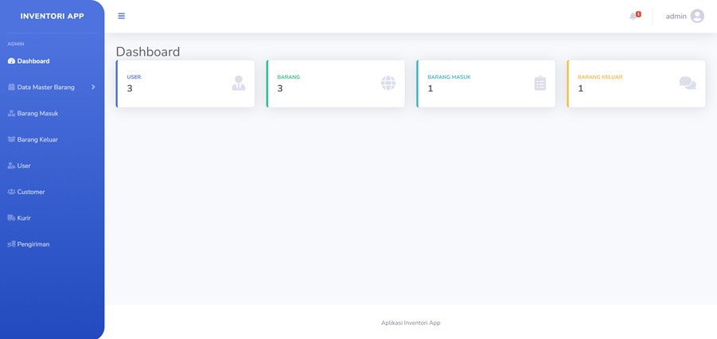

# InternetHome

Project test kerja ke 2 fullstack developer menggunakan Laravel dan React Js dari inertia.js.

## Login Role

Untuk admin email: admin@gmail.com password: admin123 Untuk Staff username: staff@gmail.com password: staff123

<!-- `dadsasd`

`ANOTHER_API_KEY` -->

## Preview Project



## Database

**File record database ada di folder (public/database)**

## Teknologi Stack

**Client:** React.js, Bootstrap

**Server:** Laravel 9

## Run Project

Install composer dependencies

Install dependencies

```bash
  npm install
```

Run Server

```bash
  php artisan serve
```

Run Client

```bash
  npm run dev
```
